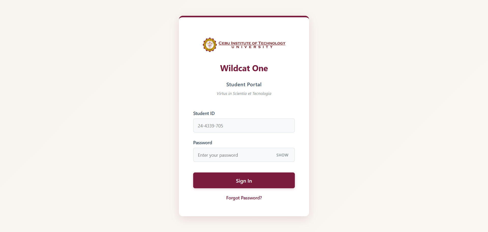
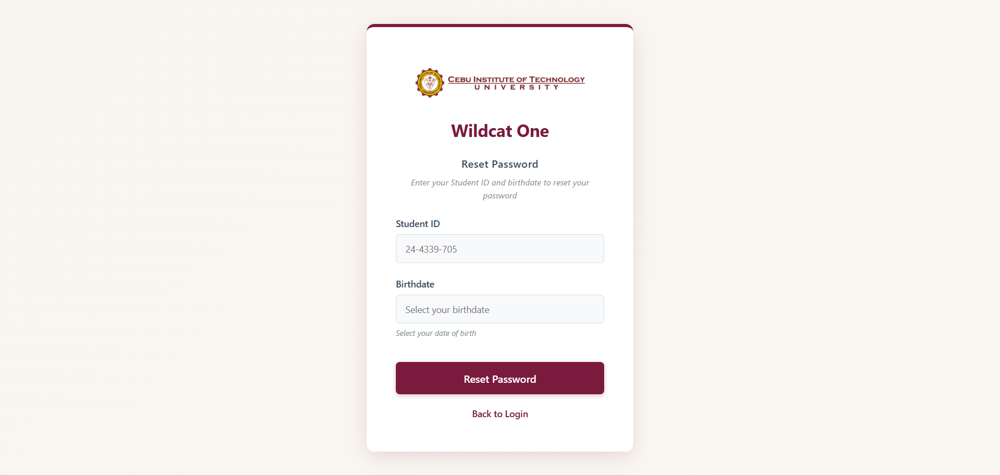
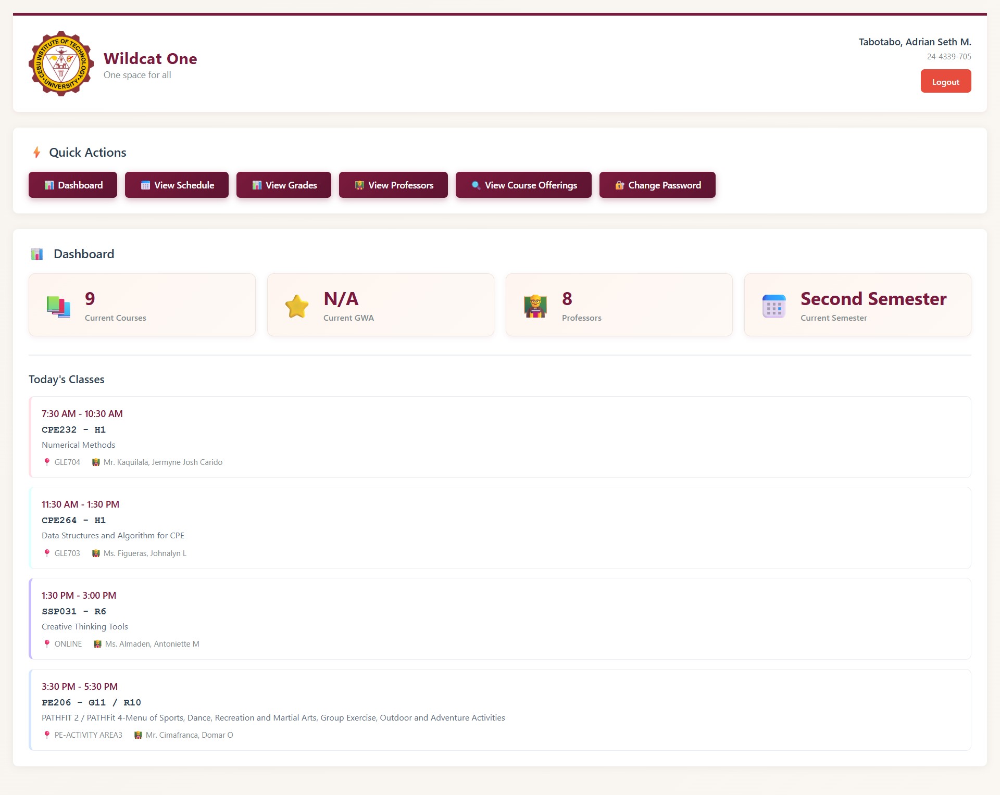
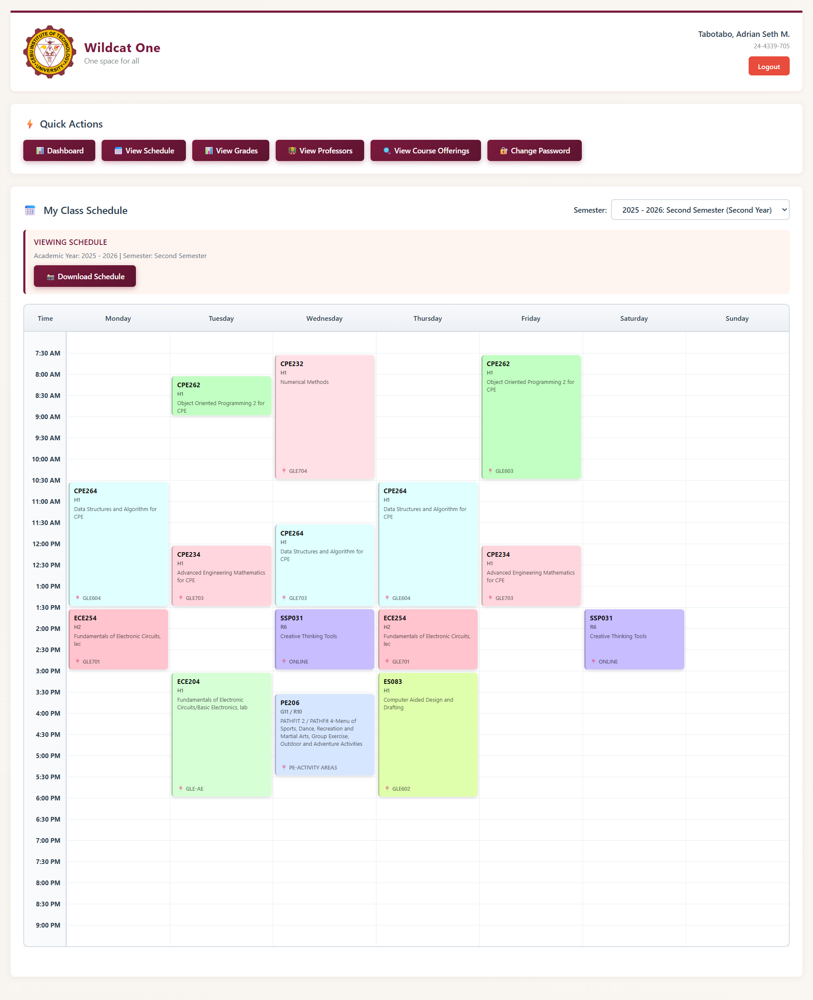
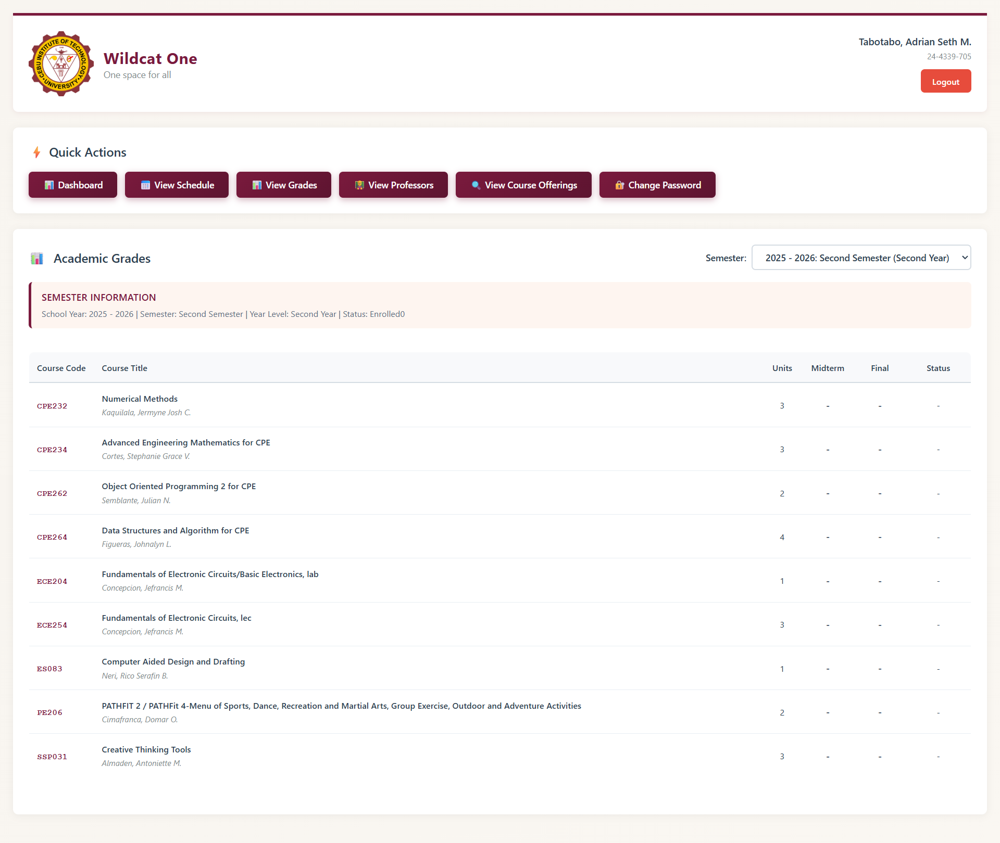
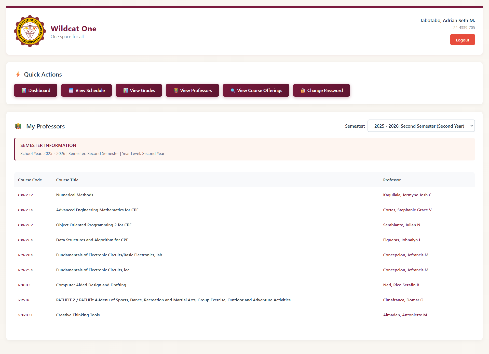
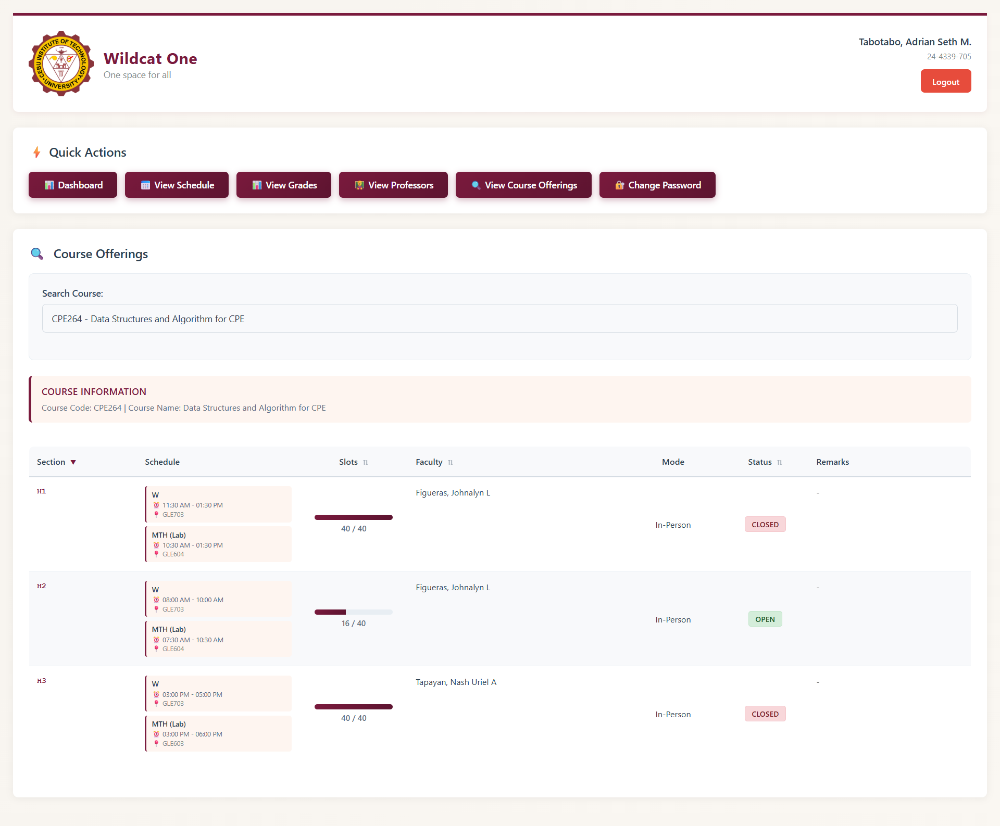
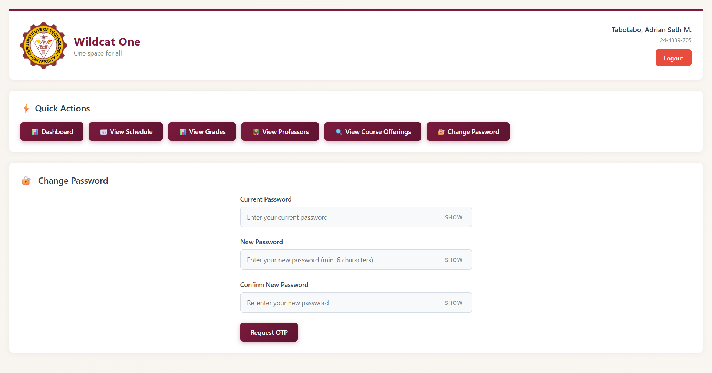

# Wildcat One

> An unofficial student portal for CIT-U (Cebu Institute of Technology – University) students.

**Live demo:** [wits-student.vercel.app](https://wits-student.vercel.app)

## Screenshots

<table>
  <tr>
    <td align="center"><b>Login</b><br/></td>
    <td align="center"><b>Reset Password</b><br/></td>
  </tr>
  <tr>
    <td align="center"><b>Dashboard</b><br/></td>
    <td align="center"><b>Class Schedule</b><br/></td>
  </tr>
  <tr>
    <td align="center"><b>Grades</b><br/></td>
    <td align="center"><b>Professors</b><br/></td>
  </tr>
  <tr>
    <td align="center"><b>Course Offerings</b><br/></td>
    <td align="center"><b>Change Password</b><br/></td>
  </tr>
</table>

---

> **Disclaimer:** This is an independent, community-built wrapper and is **not** affiliated with, endorsed by, or officially supported by Cebu Institute of Technology – University. It communicates with the same backend APIs the official WITS portal uses. Use at your own discretion.

---

## Features

| Section | What it does |
|---|---|
| **Dashboard** | Overview of current courses, GWA, professors, and today's schedule |
| **Class Schedule** | Weekly grid view with one-click PNG export via html2canvas |
| **Grades** | Midterm and final grades across all enrolled semesters |
| **Professors** | Professor list per semester |
| **Course Offerings** | Search available sections, remaining slots, and meeting schedules |
| **Change Password** | OTP-verified password change with animated field flip transition |
| **Forgot Password** | OTP-based account recovery flow |
| **Responsive UI** | Mobile-friendly with hamburger nav, swipe scroll hints, and slow-connection/offline banners |

## Tech Stack

- **React 18** — UI layer
- **Vite 6** — build tool with Terser minification and manual chunk splitting
- **CryptoJS** — AES-256-CBC payload encryption + HMAC-SHA256 request signing
- **html2canvas** — client-side schedule PNG export
- **react-datepicker** — date inputs (e.g. in the password change flow)
- **Cloudflare Workers** — CORS proxy between the SPA and the university's backend

## Getting Started

```bash
# 1. Clone
git clone https://github.com/dreeyanzz/wits-student.git
cd wits-student

# 2. Install dependencies
npm install

# 3. Start the dev server (available on your local network via --host)
npm run dev

# 4. Build for production
npm run build

# 5. Preview the production build locally
npm run preview
```

No environment variables or `.env` files are required — all configuration lives in `src/config/constants.js`.

## Project Structure

```
src/
├── App.jsx                    # Root component; owns auth state and section routing
├── index.jsx                  # React entry point
│
├── components/
│   ├── Login.jsx              # Login form with input validation
│   ├── ForgotPassword.jsx     # OTP-based password recovery
│   ├── Dashboard.jsx          # Courses, GWA, today's schedule overview
│   ├── Schedule.jsx           # Weekly schedule grid + PNG export
│   ├── Grades.jsx             # Grade viewer across semesters
│   ├── Professors.jsx         # Professor list per semester
│   ├── CourseOfferings.jsx    # Course search and section browser
│   ├── ChangePassword.jsx     # OTP-verified password change
│   ├── ScheduleModal.jsx      # Full-screen schedule modal
│   ├── ScheduleTooltip.jsx    # Hover/tap course detail tooltip
│   ├── SessionRestoreOverlay.jsx  # Full-screen loading overlay
│   │
│   └── shared/
│       ├── ErrorBoundary.jsx  # React error boundary wrapping all sections
│       ├── ErrorState.jsx     # Reusable fetch-error display
│       ├── LoadingState.jsx   # Spinner / skeleton placeholder
│       ├── EmptyState.jsx     # Empty result display
│       ├── SectionHeader.jsx  # Consistent page headings
│       ├── SemesterSelector.jsx  # Dropdown for year/term selection
│       ├── ScrollHint.jsx     # Swipe-left hint for mobile tables
│       ├── SlowConnectionBanner.jsx  # Slow/offline network warning
│       └── WrapperNotice.jsx  # Disclaimer acknowledgment modal
│
├── hooks/
│   ├── useScrollHint.js       # Controls scroll hint visibility
│   └── useSlowConnection.js   # Detects slow or offline network state
│
├── services/
│   ├── api.js                 # ApiService — all HTTP calls, encryption, CORS proxy routing
│   ├── auth.js                # AuthService — login, logout, session restore
│   └── storage.js             # StateManager singleton — auth tokens, user data, localStorage
│
├── config/
│   └── constants.js           # API URLs, encryption keys, time slots, color palette
│
├── utils/
│   ├── crypto.js              # AES-256-CBC encrypt/decrypt, HMAC-SHA256 signing
│   ├── validation.js          # Student ID, email, and password pattern validators
│   ├── errors.js              # Custom error classes
│   ├── dom.js                 # Color helpers, mobile detection
│   └── time.js                # Time slot parsing, day-of-week conversion
│
└── styles/
    ├── index.css              # Global styles and CSS variables
    └── *.css                  # Component-scoped stylesheets
```

## Architecture

### Navigation

Navigation is **state-based**, not route-based. `App.jsx` holds an `activeSection` string (`'dashboard'`, `'schedule'`, `'grades'`, etc.) and conditionally renders the matching page component. React Router DOM is installed but not used for routing.

### State Management

`src/services/storage.js` exports a `StateManager` singleton that stores:

- Auth token and user profile
- Academic context (available years and terms)
- Selected semester

All state is persisted to `localStorage` under the `wildcatOne_` key prefix. A `storage` event listener enables automatic cross-tab logout when the session is cleared in another tab.

### API Layer

`ApiService` (`src/services/api.js`) handles all HTTP communication:

1. Routes every request through a **Cloudflare Workers CORS proxy**
2. **Encrypts** request payloads with AES-256-CBC
3. **Signs** each request with HMAC-SHA256 using a per-request nonce + salt, sent in custom headers (`X-HMAC-Nonce`, `X-HMAC-Salt`, `X-HMAC-Signature`, `X-Origin`)
4. **Auto-decrypts** encrypted responses
5. **Forces logout** and page reload on any `401 Unauthorized` response

Two separate backend hosts are configured — one for login (`LOGIN_URL`), one for data (`BASE_URL`), both defined in `src/config/constants.js`.

### Authentication

`AuthService` (`src/services/auth.js`) handles:

- **Login:** validate inputs → POST credentials + `clientId` → store JWT + user data in `StateManager` → initialize academic context (student info, available years and terms)
- **Session restore:** runs on every app mount; re-validates the full auth chain and restores state from `localStorage` if the token is still valid
- **Logout:** clears `StateManager` and triggers a page reload

### Race Condition Prevention

Data-fetching components (Schedule, Grades, Professors, CourseOfferings) use a **`loadCounterRef` pattern**:

1. A `useRef` counter is incremented before each fetch
2. The counter value is captured at fetch start
3. When the response arrives, it is discarded if the captured value no longer matches the current counter

This prevents stale responses from a previous semester selection overwriting results from a newer one.

### Build Optimizations

`vite.config.js` configures:

- **Terser** minification with `drop_console` and `drop_debugger`
- **Manual chunk splitting** — page components in one chunk, services/utils in another
- **CSS code splitting** per component

## Contributing

Contributions are welcome. Please follow these steps:

1. Fork the repository and create a feature branch (`git checkout -b feat/your-feature`)
2. Make your changes, keeping the existing patterns in mind:
   - Use the shared components in `src/components/shared/` where possible
   - Add new API calls through `ApiService`, not via raw `fetch`
   - Use emoji characters for icons — inline SVGs are intentionally avoided
   - Keep secrets and URLs in `src/config/constants.js`
3. Verify the build passes: `npm run build`
4. Open a pull request with a clear description of what changed and why

There is no test runner configured. Manual testing against the live backend is the current approach.

## License

MIT
